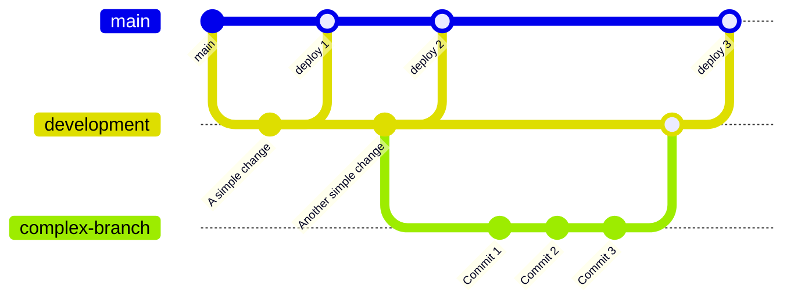

# Cozy Cat Cottage Public Website

This is the public website for the non-profit shelter Cozy Cat Cottage in Powell, OH.  It is built using [Next.js](https://nextjs.org/) with [`create-next-app`](https://github.com/vercel/next.js/tree/canary/packages/create-next-app).  For details on using those frameworks, see the attached links.

## Recommendations for Local Development

- [PNPM](https://pnpm.io/installation) - A package manager for installing software frameworks and pacakges that this site uses.  Alternate package managers can be `yarn` or `npm`, however since this was originally set up with `pnpm`, any documentation below will assume that is what is being used.
- [GitHub Desktop](https://desktop.github.com/) - UI for the git source control software.  For those that love the command line, the base [git CLI](https://git-scm.com/) will also work.
- [Visual Studio Code](https://code.visualstudio.com/) - A text editor that has many plugins for writing code.

## Frameworks / Dependencies

Here is a list of things you'll need to know about in order to make updates to the site.

- [HTML](https://www.w3schools.com/html/) - Base markup language of websites.  Hopefully you already know this.
- [CSS](https://www.w3schools.com/css/) - Stylesheets for making the site look like it should.
- [Typescript](https://www.typescriptlang.org/) - Javascript with additional syntax for controlling variable types.
- [Next.js](https://nextjs.org/) - [Next.js documentation](https://nextjs.org/docs) and [Next.js tutorials](https://nextjs.org/learn) are good places to start.
- [React-Boostrap](https://react-bootstrap.github.io/getting-started/introduction/) - A react implementation of Twitter Boostrap with predefined react components.
- [MailChimp](https://mailchimp.com/) - Used for the mailing list.  The form for the signup is managed in the administration pages of this.
- [AWS][https://aws.amazon.com/] - Amazon Web Services is where the site is hosted.
    - [AWS Amplify](https://aws.amazon.com/amplify/) - A deployment tool that hooks up to our GitHub project repository to do automated deployment when commits happen to the project.
    - [AWS S3](https://aws.amazon.com/s3/) - AWS Simple Storage Solution; actual storage location of files as they are deployed by Amplify.

## Getting Started

### Clone the project

Start by cloning this project with GitHub Desktop.  Then make sure to do a checkout of the development branch, as this is the branch that changes will be made to before being deployed to the live site.

### Running a local server

Open a terminal and run the development server:

```bash
cd /path/to/cozycatcottage/
pnpm dev
```

Open [http://localhost:3000](http://localhost:3000) with your browser to see the result.

You can start editing the page by modifying `pages/index.tsx`. The page auto-updates as you edit the file.

[API routes](https://nextjs.org/docs/api-routes/introduction) can be accessed on [http://localhost:3000/api/hello](http://localhost:3000/api/hello). This endpoint can be edited in `pages/api/hello.ts`.

The `pages/api` directory is mapped to `/api/*`. Files in this directory are treated as [API routes](https://nextjs.org/docs/api-routes/introduction) instead of React pages.

## Making changes

To ensure changes are properly previewed prior to being deployed to the live site, this project uses a persistant `development` branch that has a separate deployment URL.  No changes should be made directly to the master branch.  If changes are small enough (i.e. very simple text changes), a commit to the `development` branch is fine.  If changes are more in depth, it is suggested that you make a branch off of the `development` branch for the feature you are adding.  Then a pull request can be made into the `development` branch once that code is ready.



Once a change has been previewed and approved, a pull request from the `development` branch can be done to the `main` branch to deploy the changes to the live site.

Development site URL: TBD
Live site URL: TBD