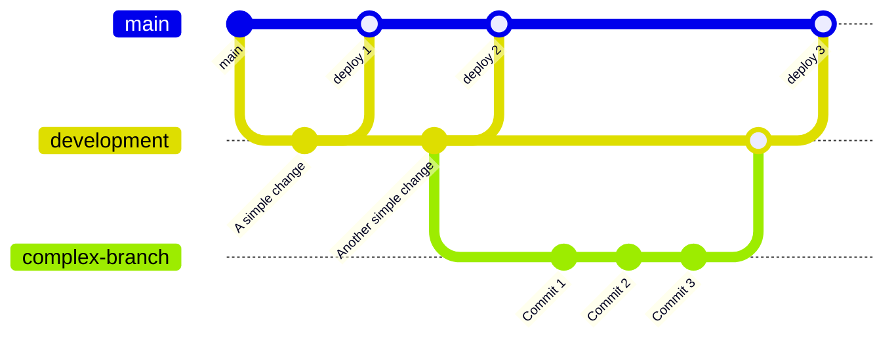

# Cozy Cat Cottage Public Website

This is the public website for the non-profit shelter Cozy Cat Cottage in Powell, OH.  It is built using [Next.js](https://nextjs.org/) with [`create-next-app`](https://github.com/vercel/next.js/tree/canary/packages/create-next-app).  For details on using those frameworks, see the attached links.

## Recommendations for Local Development

- [PNPM](https://pnpm.io/installation) - A package manager for installing software frameworks and pacakges that this site uses.  Alternate package managers can be `yarn` or `npm`, however since this was originally set up with `pnpm`, any documentation below will assume that is what is being used.  Note though that the amplify build process will still use a base npm command, which is fine.
- [GitHub Desktop](https://desktop.github.com/) - UI for the git source control software.  For those that love the command line, the base [git CLI](https://git-scm.com/) will also work.
- [Visual Studio Code](https://code.visualstudio.com/) - A text editor that has many plugins for writing code.

## Frameworks / Dependencies

Here is a list of things you'll need to know about in order to make updates to the site.

- [HTML](https://www.w3schools.com/html/) - Base markup language of websites.  Hopefully you already know this.
- [CSS](https://www.w3schools.com/css/) - Stylesheets for making the site look like it should.
- [Typescript](https://www.typescriptlang.org/) - Javascript with additional syntax for controlling variable types.
- [Next.js](https://nextjs.org/) - [Next.js documentation](https://nextjs.org/docs) and [Next.js tutorials](https://nextjs.org/learn) are good places to start.
- [React-Boostrap](https://react-bootstrap.github.io/getting-started/introduction/) - A react implementation of Twitter Boostrap with predefined react components.
- [MailChimp](https://mailchimp.com/) - Used for the mailing list.  The form for the signup is managed in the administration pages of this.
- [AWS](https://aws.amazon.com/) - Amazon Web Services is where the site is hosted.
    - [AWS Amplify](https://aws.amazon.com/amplify/) - A deployment tool that hooks up to our GitHub project repository to do automated deployment when commits happen to the project.
    - [AWS S3](https://aws.amazon.com/s3/) - AWS Simple Storage Solution; actual storage location of files as they are deployed by Amplify.
    - [AWS SES](https://aws.amazon.com/ses/) - AWS Simple Email Service; used to send the email for the memorial tribute/honoring form.

## Getting Started

### Clone the project

Start by cloning this project with GitHub Desktop.  Then make sure to do a checkout of the development branch, as this is the branch that changes will be made to before being deployed to the live site.

### Running a local server

Open a terminal and run the development server:

```bash
cd /path/to/cozycatcottage/
pnpm install
pnpm dev
```

Open [http://localhost:3000](http://localhost:3000) with your browser to see the result.

[API routes](https://nextjs.org/docs/api-routes/introduction) can be accessed on [http://localhost:3000/](http://localhost:3000/) from their corresponding page in the pages directory. So `pages/adopt.tsx` will be rendered to [http://localhost:3000/adopt](http://localhost:3000/adopt). Additionally, api endpoints can are available in the `pages/api/*` subdirectory to route to their corresponding `http://localhost:3000/api/*` endpoint.

## Making changes

To ensure changes are properly previewed prior to being deployed to the live site, this project uses a persistant `development` branch that has a separate deployment URL.  No changes can be made directly to the `main` branch.  If changes are small enough (i.e. very simple text changes), a commit to the `development` branch directly is fine.  If changes are more in depth, it is suggested that you make a branch off of the `development` branch for the feature you are adding.  Then a pull request can be made into the `development` branch once that code is ready.



Once a change has been previewed and approved on the development site, a pull request from the `development` branch can be done to the `main` branch to deploy the changes to the live site.  Do not remove the `development` branch as part of the deployment.

- Development site URL: [http://development.cozycatcottage.org](http://development.cozycatcottage.org)
- Live site URL: [http://www.cozycatcottage.org](http://www.cozycatcottage.org)

## Credentials

All credentials needed for the site are kept in environment variables in the AWS Amplify studio console.  To use these in local development, you'll need to copy them down to a `.env` file in the root directory of the project.  This file will not be included in source control commits, and credentails should never be added to source control if they are sensitive in any nature.  Though something like a Google Analytics ID is fine, since it will always be exposed to the client in the final build anyway.  Currently, credentials are only being used for sending email on the tribute form via AWS SES.

The credentials are placed into the production system through a customized build script found at [https://docs.aws.amazon.com/amplify/latest/userguide/ssr-environment-variables.html](https://docs.aws.amazon.com/amplify/latest/userguide/ssr-environment-variables.html).

### Local .env example

If you need to test the memorial tribute/honoring form, you'll need to set up a local environment file.  This file is ignored as part of the .gitignore list, so will not be committed.  Fetch the variable values from the AWS amplify environment variables in the Amplify console.

```ini
.env
SES_ACCESS_KEY=
SES_SECRET_ACCESS_KEY=
```

### Node package updates

Periodically, package dependencies should be updated to ensure that they are being properly packed from vulnerabilities discovered.  To do so, run the following:

```bash
cd /path/to/cozycatcottage/
pnpm update
```

## Deployment

The front-end resources for the site are deployed to AWS in a S3 bucket are specific to Amplify with NextJS sites.  These are not deployed into a S3 bucket created in the CozyCatCottage AWS account and are instead part of the AWS CDN (CloudFront) to better push that content closer to those that are requesting it.  So when a site is deployed, you will not see individual resources created for the front-end of the site and the only reference to it is through the Amplify console.